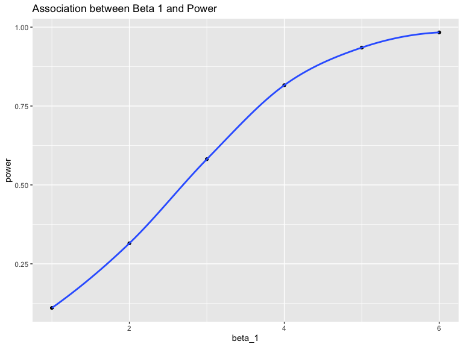

p8105 homework 5
================
Xintao Ding
11/9/2019

## Problem 1

write a function that takes a vector as an argument; replaces missing
values using the rules defined above; and returns the resulting
vector;apply this function to the columns of iris\_with\_missing using a
map statement

``` r
set.seed(10)
iris_with_missing = iris %>% 
  map_df(~replace(.x, sample(1:150, 20), NA)) %>%
  mutate(Species = as.character(Species))

#define a function
missing_values_replacement = function(x) {
  if(is.numeric(x)) {
    replace(x, is.na(x), mean(x, na.rm = TRUE)) #replace numeric missing values with mean 
  } else if (is.character(x)) {
    replace(x, is.na(x), "virginica")   #replace character missing values with a certain word
}
  }

iris_withnot_missing = map_dfr(iris_with_missing, missing_values_replacement) # map the function to iris_with_missing
iris_withnot_missing
```

    ## # A tibble: 150 x 5
    ##    Sepal.Length Sepal.Width Petal.Length Petal.Width Species
    ##           <dbl>       <dbl>        <dbl>       <dbl> <chr>  
    ##  1         5.1          3.5         1.4         0.2  setosa 
    ##  2         4.9          3           1.4         0.2  setosa 
    ##  3         4.7          3.2         1.3         0.2  setosa 
    ##  4         4.6          3.1         1.5         1.19 setosa 
    ##  5         5            3.6         1.4         0.2  setosa 
    ##  6         5.4          3.9         1.7         0.4  setosa 
    ##  7         5.82         3.4         1.4         0.3  setosa 
    ##  8         5            3.4         1.5         0.2  setosa 
    ##  9         4.4          2.9         1.4         0.2  setosa 
    ## 10         4.9          3.1         3.77        0.1  setosa 
    ## # … with 140 more rows

## Problem 2

``` r
# create a dataframe with list file names
file_name <- list.files("./data") 
df <- tibble(file_name)
df <- df %>% 
  mutate(outcome = map(file_name, ~read_csv(str_c("./data/", .x)))) # iterate file names and save as a new variable
df
```

    ## # A tibble: 20 x 2
    ##    file_name  outcome         
    ##    <chr>      <list>          
    ##  1 con_01.csv <tibble [1 × 8]>
    ##  2 con_02.csv <tibble [1 × 8]>
    ##  3 con_03.csv <tibble [1 × 8]>
    ##  4 con_04.csv <tibble [1 × 8]>
    ##  5 con_05.csv <tibble [1 × 8]>
    ##  6 con_06.csv <tibble [1 × 8]>
    ##  7 con_07.csv <tibble [1 × 8]>
    ##  8 con_08.csv <tibble [1 × 8]>
    ##  9 con_09.csv <tibble [1 × 8]>
    ## 10 con_10.csv <tibble [1 × 8]>
    ## 11 exp_01.csv <tibble [1 × 8]>
    ## 12 exp_02.csv <tibble [1 × 8]>
    ## 13 exp_03.csv <tibble [1 × 8]>
    ## 14 exp_04.csv <tibble [1 × 8]>
    ## 15 exp_05.csv <tibble [1 × 8]>
    ## 16 exp_06.csv <tibble [1 × 8]>
    ## 17 exp_07.csv <tibble [1 × 8]>
    ## 18 exp_08.csv <tibble [1 × 8]>
    ## 19 exp_09.csv <tibble [1 × 8]>
    ## 20 exp_10.csv <tibble [1 × 8]>

``` r
# tidy data frame
tidy_df <- df %>% 
  separate(file_name, into = c("arm", "subject_id"), sep = "_") %>% 
  mutate (subject_id = gsub("\\.csv", "", subject_id)) %>%  # include subject ID
  unnest() %>% 
  pivot_longer(
    week_1:week_8,
    names_to = "week",
    values_to = "outcome"
  )
  
tidy_df
```

    ## # A tibble: 160 x 4
    ##    arm   subject_id week   outcome
    ##    <chr> <chr>      <chr>    <dbl>
    ##  1 con   01         week_1    0.2 
    ##  2 con   01         week_2   -1.31
    ##  3 con   01         week_3    0.66
    ##  4 con   01         week_4    1.96
    ##  5 con   01         week_5    0.23
    ##  6 con   01         week_6    1.09
    ##  7 con   01         week_7    0.05
    ##  8 con   01         week_8    1.94
    ##  9 con   02         week_1    1.13
    ## 10 con   02         week_2   -0.88
    ## # … with 150 more rows

``` r
# plotting
plot <- tidy_df %>% 
  ggplot(aes(x = week, y = outcome, group = subject_id, color = subject_id)) +
  geom_line() +
  facet_grid(~arm) +
  labs(title = "Observatinos on Each Subject over Time")
plot
```


Subjects in control arm have overall lower outcomes than those of
subjects in the experimental arm. Subjects in the experimantal arm also
see a bigger variance in outcome over 8 weeks, whereas subjects in the
control arm have outcomes that do not fluctuate much over the 8 week
course.

## Problem 3

``` r
set.seed(1)
sim_regression = function(n = 30, beta0 = 2, beta1){
  sim_data = tibble (
    x = rnorm(n, mean = 0, sd = 1),
    y = beta0 + beta1 * x + rnorm(n, 0, sd = sqrt(50))
  )
  ls_fit <- lm(y ~ x, data = sim_data) %>% 
    broom::tidy() 
  
tibble(
    beta1_hat = ls_fit[[2,2]],
    beta1_p = ls_fit[[2,5]]
    )    
  
}

# simulation when beta 1 is 0
output <-  rerun(10000, sim_regression(beta1 = 0)) %>% 
  bind_rows()
output
```

    ## # A tibble: 10,000 x 2
    ##    beta1_hat beta1_p
    ##        <dbl>   <dbl>
    ##  1   0.296     0.798
    ##  2   0.00648   0.996
    ##  3  -2.16      0.155
    ##  4  -0.454     0.718
    ##  5  -0.514     0.730
    ##  6   1.71      0.243
    ##  7  -1.18      0.322
    ##  8   1.09      0.366
    ##  9   0.806     0.377
    ## 10   2.35      0.131
    ## # … with 9,990 more rows

``` r
# when β1={1,2,3,4,5,6}
sim_results <- tibble(beta_1 = c(1,2,3,4,5,6)) %>% 
  mutate(output_list = map(.x = beta_1, ~rerun(10000, sim_regression(beta1= .x))),
         output_df = map(output_list, bind_rows))%>%
  select(-output_list) %>% 
  unnest(output_df)

head(sim_results)
```

    ## # A tibble: 6 x 3
    ##   beta_1 beta1_hat beta1_p
    ##    <dbl>     <dbl>   <dbl>
    ## 1      1    3.03    0.0247
    ## 2      1    1.39    0.295 
    ## 3      1    1.93    0.103 
    ## 4      1    0.0151  0.990 
    ## 5      1    0.111   0.944 
    ## 6      1   -1.24    0.366

``` r
# Plotting
sim_results %>% 
  mutate(reject_null = ifelse(beta1_p <= 0.05, 1,0))%>% 
  group_by(beta_1) %>% 
  summarise(power = mean(reject_null)) %>%  #proportion of time null is rejected
  ggplot(aes(x = beta_1, y = power)) +
  geom_point() +
  geom_smooth(se = FALSE) +
  labs(title = "Association between Beta 1 and Power")
```



We can see that as effect size increases, power increases

``` r
# Plotting
sim_results %>% 
  group_by(beta_1) %>% 
  summarize(avg_beta1_hat = mean(beta1_hat)) %>% 
  ggplot(aes(x = beta_1, y = avg_beta1_hat)) + 
  geom_point() +
  geom_smooth(se = FALSE) +
  labs(title = "Association between Beta 1 and Average Beta 1 hat", 
       x = "True Beta 1", 
       y = "Average Beta 1 Hat")
```


``` r
sim_results %>% 
  mutate(reject_null = ifelse(beta1_p <= 0.05, 1,0)) %>% 
  filter(reject_null == 1) %>% 
  group_by(beta_1) %>%
  summarise(avg_beta1_hat = mean(beta1_hat)) %>% 
  ggplot(aes(x = beta_1, y = avg_beta1_hat)) +
  geom_point() +
  geom_smooth(se = FALSE) + 
  labs(title = "Assocation between Beta 1 and Average Beta 1 Hat that Reject Null", 
      x = "True Beta 1", 
      y = "Average Beta 1 Hat")
```


We can see from the first graph that the true beta 1 values and average
estimated beta 1 values are approximately the same. However, when we
look at the second graph, when the null hypothesis is rejected, average
estimated beta 1 values are not as close in value to true beta 1.
